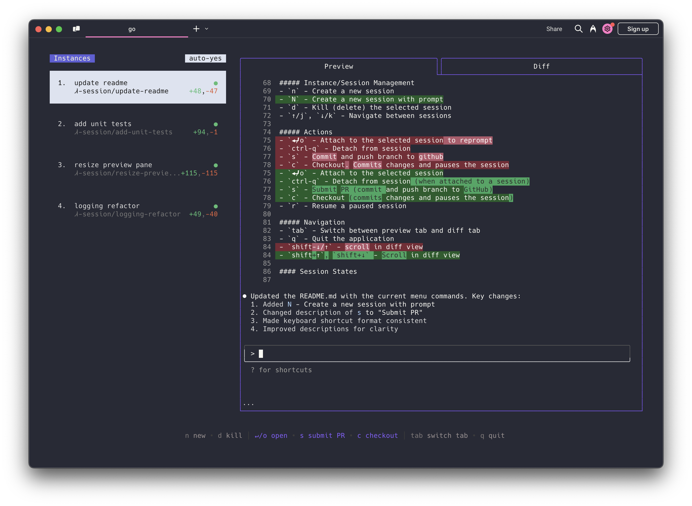

# Adroit

[](https://github.com/AlexanderWeismannn/adroit/releases)
[](https://github.com/AlexanderWeismannn/adroit/actions/workflows/build.yml)
[](https://alexanderweismannn.github.io/adroit/)
[](LICENSE.md)

Adroit is a terminal app that manages multiple coding agents — [Claude Code](https://github.com/anthropics/claude-code), [Codex](https://github.com/openai/codex), [Gemini](https://github.com/google-gemini/gemini-cli), [Aider](https://github.com/Aider-AI/aider) — each in its own isolated git workspace, so you can run several tasks at once and review them side by side.

It is a fork of [claude-squad](https://github.com/smtg-ai/claude-squad), which contributed the tmux-and-git-worktree foundation. The session model, the instance list, theming and most of the interface have since been reworked; see [Differences from claude-squad](#differences-from-claude-squad).



### Highlights

- Complete tasks in the background, including auto-accept mode
- Manage every session from one terminal window
- Review the diff before applying, check changes out before pushing
- Each session gets its own git worktree and branch, so nothing collides
- Each row carries its branch, CI verdict and pull-request state at a glance

## Quick start

```bash
curl -fsSL https://raw.githubusercontent.com/AlexanderWeismannn/adroit/main/install.sh | bash
cd ~/code/your-project     # any git repository
adroit
```

Press `n` to start a session, type a name, and you are attached to Claude Code
in a fresh worktree. `ctrl-q` brings you back to the list; `?` shows every key.

The installer ends by running `adroit doctor`, which says what is still missing
and the command that installs it on your machine. Run it again any time.

## Requirements

Linux, macOS, or Windows through [WSL](https://learn.microsoft.com/windows/wsl/install).
tmux is the session model, so native Windows is not supported.

| Tool | Needed for | macOS | Debian / Ubuntu / WSL |
|------|------------|-------|-----------------------|
| [git](https://git-scm.com/) | every session is a worktree | `xcode-select --install` | `sudo apt install git` |
| [tmux](https://github.com/tmux/tmux/wiki/Installing) | every session runs in tmux | `brew install tmux` | `sudo apt install tmux` |
| An agent — [Claude Code](https://docs.anthropic.com/en/docs/claude-code) by default | what each session runs | `curl -fsSL https://claude.ai/install.sh \| bash` | same |
| [gh](https://cli.github.com/), logged in (`gh auth login`) | *optional* — CI status, pull-request state, `g` | `brew install gh` | [GitHub's apt repo](https://github.com/cli/cli/blob/trunk/docs/install_linux.md) |

Adroit refuses to start without git, tmux and the agent, and says which is
missing. Without `gh` everything works except the CI and pull-request columns.

The optional dev stack (`d`) also uses `ss` or `lsof` to tell which worktree owns
a port; without them its readiness lamps still work.

## Install

### Installer (recommended)

```bash
curl -fsSL https://raw.githubusercontent.com/AlexanderWeismannn/adroit/main/install.sh | bash
```

It downloads the latest release for your platform, verifies its checksum,
installs it to `~/.local/bin/adroit`, and adds that directory to `PATH` in your
shell profile if it is not there yet. Options go after `bash -s --`:

```bash
curl -fsSL https://raw.githubusercontent.com/AlexanderWeismannn/adroit/main/install.sh | bash -s -- --install-deps --with-cs
```

| Option | Effect |
|--------|--------|
| `--install-deps` | Install missing tmux (and gh, where the package manager has a current one) |
| `--with-cs` | Also link `cs`, if you have scripts or muscle memory from claude-squad |
| `--version X.Y.Z` | Install that release instead of the latest |
| `--bin-dir DIR` | Install somewhere other than `~/.local/bin` |
| `--no-path` | Leave your shell profile alone |

Run the same command again to upgrade.

### With Go

```bash
go install github.com/AlexanderWeismannn/adroit@latest
```

Needs Go 1.23 or newer, and puts the binary in `$(go env GOPATH)/bin`.

### From source

```bash
git clone https://github.com/AlexanderWeismannn/adroit && cd adroit
go build -o ~/.local/bin/adroit .
```

### Coming from claude-squad

Adroit keeps its state in `~/.adroit`, not `~/.claude-squad`. If it finds
claude-squad sessions and no Adroit ones, it stops and offers to migrate them
(config, sessions, worktrees and tmux sessions) with
[`scripts/migrate-to-adroit.sh`](scripts/migrate-to-adroit.sh), or to start
fresh with `adroit --skip-claude-squad-migration`.

The upstream Homebrew formula and installer install claude-squad, not Adroit.

## Usage

```
Usage:
  adroit [flags]
  adroit [command]

Available Commands:
  completion  Generate the autocompletion script for the specified shell
  debug       Print debug information like config paths
  doctor      Check that the tools Adroit depends on are installed
  help        Help about any command
  reset       Reset all stored instances
  theme       Show, list, and change the colour theme
  version     Print the version number

Flags:
  -y, --autoyes          [experimental] If enabled, all instances will automatically accept prompts
  -h, --help             help for adroit
  -p, --program string   Program to run in new instances (e.g. 'aider --model ollama_chat/gemma3:1b')
```

Run it from inside a git repository. One Adroit runs at a time; closing the
terminal does not stop it or its sessions, because tmux keeps them alive — run
`adroit` again to get back.

The default program is `claude`, and it is worth keeping that on its latest version.

**Using other agents:**

- For [Codex](https://github.com/openai/codex), set your key: `export OPENAI_API_KEY=<your_key>`
- Launch a one-off: `adroit -p "codex"`, `adroit -p "aider ..."`, `adroit -p "gemini"`
- Make it the default with `default_program`, or define [profiles](#profiles) to pick per session

## Keys

The menu at the bottom of the screen shows what is available in the current context.

### Sessions

- `n` — new session
- `N` — new session, prompting for its first message
- `tab` at the name prompt — start on an existing branch, or on none at all
- `D` — kill the selected session
- `↑`/`k`, `↓`/`j` — move between sessions
- `K`, `J` — reorder the selected session in the list

### Actions

- `↵`/`o` — attach to the session
- `ctrl-q` — detach
- `p` — commit and push the branch
- `c` — checkout: commit, then pause the session and remove its worktree
- `r` — resume a paused session
- `g` — open the session's pull request in a browser
- `u` — update: bring in the commits pushed to the branch since the worktree was
  created. Offered only on a row whose badge says there are some
- `t` — change the colour theme
- `?` — help

### Navigation

- `tab` — cycle the Preview, Diff and Terminal tabs
- `shift-↑`/`shift-↓` — scroll the active tab; `esc` leaves scroll mode
- `q` — quit

## Configuration

Adroit stores its configuration in `~/.adroit/config.json`, and its worktrees in
`~/.adroit/worktrees`. Find the exact paths with `adroit debug`.

### Upstream tracking

A worktree is a checkout that nothing updates on its own, so a session opened to
review a branch someone else is still pushing to quietly goes out of date. Adroit
fetches each session's repository at most once a minute and marks the rows that
have drifted: `↓3` for commits waiting on the remote, `⇅3/1` for a history that
has parted company with it (an upstream force-push, usually), and a dim `↑2` for
commits of your own that are not pushed. `u` clears the first two — a
fast-forward, or, for a divergence, a reset that discards the local commits after
naming how many. Both ask first.

It is the one feature that touches the network on a timer, so it can be switched
off:

```json
{ "upstream_status": false }
```

### Starting from a current base

A new session's branch is cut from wherever the main checkout is sitting, which
is only ever as fresh as the last time you pulled — so a session started on a
week-old `master` begins a week behind, and nothing says so until it surfaces as
a rebase, a conflict, or a CI run against a base that has moved. Before cutting
the branch, Adroit brings the repository's default branch up to date.

It is deliberately narrow. Only the **default** branch: a checkout parked on a
feature branch is parked there on purpose, and a session cut from it branches
from where you left it. Only a **fast-forward**: a default branch carrying local
commits, or with an uncommitted change in the way, is left exactly as it is. And
never fatal — offline, no remote or no upstream, and the session starts from the
current commit as it always did.

Switch it off on a metered connection, or where the default branch is held back
on purpose:

```json
{ "sync_base_branch": false }
```

### Themes

`adroit theme` lists the built-in themes and `adroit theme use <name>` installs one.
`t` inside the app opens a picker that previews each theme as you move through
it — the interface behind the overlay *is* the preview. Individual roles can be
overridden with a `colors` object in the config file.

### Profiles

Profiles let you define named program configurations and pick between them when
creating a session. With more than one defined, the creation overlay shows a
picker you navigate with `←`/`→`.

```json
{
  "default_program": "claude",
  "profiles": [
    { "name": "claude", "program": "claude" },
    { "name": "codex", "program": "codex" },
    { "name": "aider", "program": "aider --model ollama_chat/gemma3:1b" }
  ]
}
```

| Field     | Description                                             |
|-----------|---------------------------------------------------------|
| `name`    | Display name shown in the profile picker                |
| `program` | Shell command used to launch the agent for that profile |

With no profiles defined, `default_program` is used directly as the launch
command (the default is `claude`).

A bare name like `"claude"` is resolved on `PATH` at launch, and is what you want
in a config shared between machines. Adroit writes the *resolved* path when it
creates a config — `claude` is often an install only a login shell can find — so
copying that file elsewhere leaves it pointing at a path that does not exist
there. It repairs itself: an absolute program that is missing is looked up again
by name, keeping any arguments after it.

### Per-repository settings

Some settings are answers about *you* and some are answers about a *project*.
The second kind live under `repos`, keyed by the path of the repository root (the
main checkout, not a worktree — every session of a repository shares them). A
leading `~` is expanded, and anything a repository does not override falls back
to the top-level value:

```json
{
  "branch_prefix": "jane/",
  "repos": {
    "~/work/api": {
      "branch_prefix": "JIRA-",
      "preserve_branch_case": true,
      "dev": { "command": "npm run dev" }
    },
    "~/other-app": {
      "branch_prefix": "",
      "dev": { "command": "cargo watch -x run" }
    }
  }
}
```

| Field                  | Overrides                                        |
|------------------------|--------------------------------------------------|
| `branch_prefix`        | The prefix on branches cut in this repository    |
| `preserve_branch_case` | The case policy for those branch names           |
| `dev`                  | The development stack that runs this repository  |

`"branch_prefix": ""` means *no prefix here*, which is different from leaving the
key out (inherit the global one). A ticket convention is a property of the
project — `JIRA-` is the right answer in one repository and noise in every other.

### The dev stack

`d` runs a project's development stack — servers, watchers, a queue worker — in
the selected session's worktree, and the Run tab shows its output with a
readiness lamp per check. It is a **singleton**: the ports it binds and the
services it talks to are machine-wide, so pointing it at another session tears
the old one down.

```json
{
  "repos": {
    "~/work/api": {
      "dev": {
        "command": "npm run dev",
        "env": { "PORT": "3000" },
        "checks": [
          { "name": "redis", "type": "tcp", "target": "127.0.0.1:6379",
            "start_command": "sudo service redis-server start" },
          { "name": "web", "type": "http", "target": "http://127.0.0.1:3000/",
            "own_cwd": true }
        ],
        "open_url": "http://localhost:3000",
        "ready_timeout_seconds": 240
      }
    }
  }
}
```

| Field                   | Description                                                              |
|-------------------------|--------------------------------------------------------------------------|
| `command`               | One shell command that runs the whole stack, from the worktree root      |
| `env`                   | Added to the inherited environment                                       |
| `checks`                | Readiness lamps, polled together — `tcp` or `http`                       |
| `checks[].start_command`| Run once if that check is down at launch, for a shared service you don't own |
| `checks[].own_cwd`      | Require the process holding the port to be running inside *this* worktree |
| `open_url`              | Opened once, when every lamp is green                                    |
| `ready_timeout_seconds` | Bounds the wait for the lamps (default 180)                              |

A top-level `dev` block still works and applies to any repository with no entry
of its own. With more than one repository in play that is usually not what you
want — `npm run dev` is an answer about one project, and running it in another
repository's worktree fails in ways that have nothing to do with the code in
front of you. An entry that exists but has an empty `command` means "no stack
here" and does *not* fall back.

## Troubleshooting

Start with `adroit doctor`. It checks every dependency and prints the install
command for whatever is missing.

**`failed to start new session: timed out waiting for tmux session`** — the
agent did not start. Run the program by hand (`claude`) in the same repository
to see why; an outdated agent is the usual cause, so update it.

**The CI and pull-request columns stay empty** — `gh` is missing or not logged
in. Run `gh auth status`.

**Two status bars inside a session** — your `~/.tmux.conf` sets a status bar
globally, and Adroit's sessions inherit it. Turn it off for them only:

```tmux
set-hook -g session-created 'if -F "#{m:adroit_*,#{session_name}}" "set status off"'
```

**`adroit is already running`** — another terminal has it open. Go back there,
or `kill` the pid in the message if that one is wedged.

**Where are the logs and the config?** — `adroit debug` prints the config path
and contents. Logs go to `adroit.log` in the system temp directory
(`/tmp/adroit.log` on Linux).

**Start over** — `adroit reset` removes every stored session, its tmux session,
its worktree **and its branch**. Push anything you want to keep first.

## Uninstall

```bash
adroit reset                      # sessions, tmux sessions, worktrees and their branches
rm ~/.local/bin/adroit ~/.local/bin/cs 2>/dev/null
rm -rf ~/.adroit                  # config and state
```

## Differences from claude-squad

The worktree and tmux foundation is claude-squad's. On top of it:

- **Colour themes**, a semantic palette behind them, a CLI command and an
  in-app picker that previews as you move
- **A readable instance list on a dark terminal**, with named glyphs
- **GitHub CI verdict, pull-request state and mergeability** on each row, and
  `g` to open the pull request
- **Upstream drift on each row**, and `u` to fast-forward or reset a worktree
  onto the branch as it now stands on the remote
- **Each row labelled with the branch its worktree actually has checked out**,
  rather than the one it was created with
- **Sessions that start on an existing branch**, named after that branch
- **Sessions that run in the repository itself**, with no worktree
- **A Terminal tab** alongside Preview and Diff
- **A preview pane that shows the session it says it is showing** — see
  `5fb9800` for the four separate ways it did not

## How it works

1. **tmux** gives each agent an isolated terminal session
2. **git worktrees** give each session its own branch and checkout
3. A TUI over both, so the set of them is navigable

## License

[AGPL-3.0](LICENSE.md), inherited from claude-squad.
